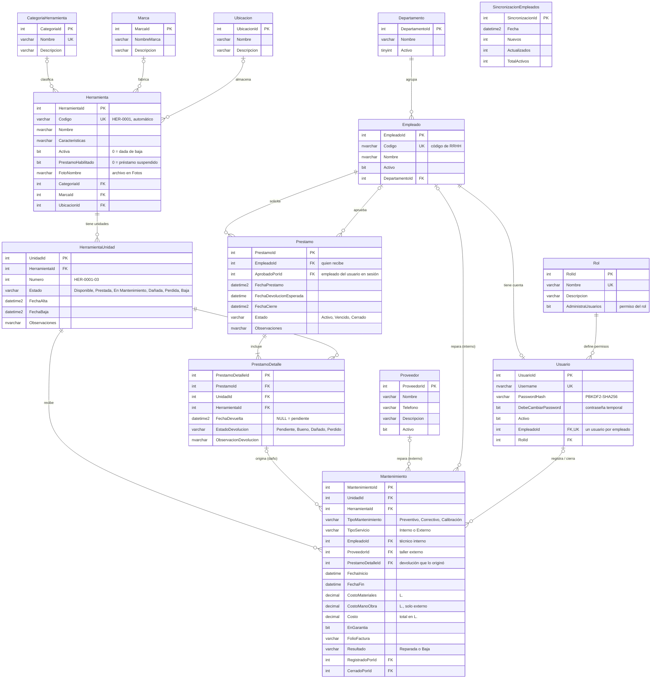

# Modelo de datos

Base de datos **PROMACO_Herramientas** (SQL Server, intercalación `Modern_Spanish_CI_AS`).
El script completo está en [`Database/instalacion/000_esquema.sql`](../Database/instalacion/000_esquema.sql).

## Diagrama entidad-relación

Versión en imagen (para documentos impresos o presentaciones): [`diagrama-er.png`](diagrama-er.png).

## Decisiones de diseño

- **Herramienta vs. unidad.** `Herramienta` es el tipo (catálogo) y `HerramientaUnidad` cada pieza física
  con su propio estado. El stock no se guarda: se calcula contando unidades (vista `vw_HerramientaStock`).
  Así una pieza dañada no bloquea a las demás del mismo tipo.
- **Préstamo por unidad.** Cada línea de `PrestamoDetalle` apunta a una unidad concreta y se devuelve por
  separado, con su condición. El préstamo se cierra solo cuando no quedan unidades pendientes.
  `HerramientaId` acompaña a `UnidadId` en una llave foránea compuesta que garantiza que la unidad
  pertenece a esa herramienta.
- **Trazabilidad del aprobador.** `Prestamo.AprobadoPorId` guarda al empleado que aprobó en ese
  momento, no al usuario: si la cuenta cambia después, el historial no se altera.
- **Roles normalizados.** El permiso de administrar usuarios es un dato del rol (`Rol.AdministraUsuarios`),
  no su nombre.
- **Contraseñas.** Solo se guarda el hash PBKDF2-SHA256 con sal (`Usuario.PasswordHash`). La columna
  `Usuario.Password` es de la versión anterior: queda vacía en cuanto cada usuario inicia sesión.
- **Nada se borra.** Herramientas, unidades y usuarios se dan de baja o se desactivan; préstamos y
  mantenimientos los siguen referenciando.
